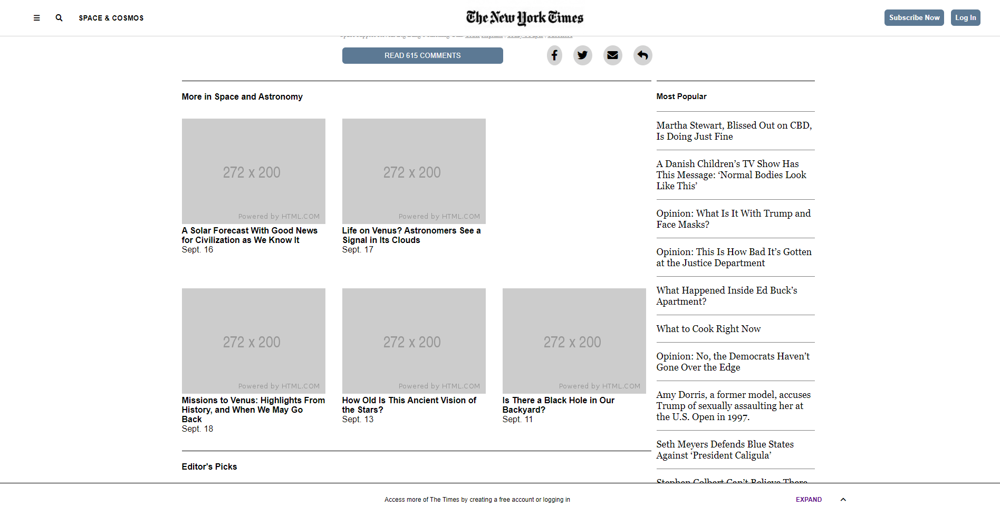

# Positioning and Floating Elements

A clone of a New York Times Article page, made using HTML and CSS and implementing all positioning elements such as Float, Flexbox, and Grid. It includes an Article section, Navbar, Footer, and various spans.

## Built With

- HTML
- CSS

## Live Demo

[Live Demo Link](https://rawcdn.githack.com/alejandrotoledoweb/nyt-article/d310f128b6c58b22066b6148ce8785b774805c77/index.html)

## Getting Started

To get a local copy up and running follow these simple example steps.

### Prerequisites

- A operating system such as Windows, MAC, or Linux
- A modern browser such as Google Chrome, Mozilla Firefox, or Microsoft Edge

### Setup
- Clone or download the repo and run the HTML File.

### Run tests
- [We use Stylelint, Lighthout, & Webhint](https://github.com/alejandrotoledoweb/nyt-article/actions/runs/265873431)
- Linters #7: Pull request #2 synchronize by Janluc

## Authors

👤 **Author1**

- GitHub: [@alejandrotoledoweb](https://github.com/alejandrotoledoweb)
- Twitter: [@alejot](https://twitter.com/alejot)
- LinkedIn: [LinkedIn](https://www.linkedin.com/in/alejandro-toledo-3b444b109/)

👤 **Author2**

- GitHub: [@Janluc](https://github.com/Janluc)
- Twitter: [@Janluc123](https://twitter.com/Janluc123)
- LinkedIn: [LinkedIn](https://www.linkedin.com/in/janluc-saneaux-91707a1b4/)

## 🤝 Contributing

Contributions, issues, and feature requests are welcome!

Feel free to check the [issues page](https://github.com/alejandrotoledoweb/nyt-article/issues).

## Show your support

Give a ⭐️ if you like this project!

## 📝 License

N/A
